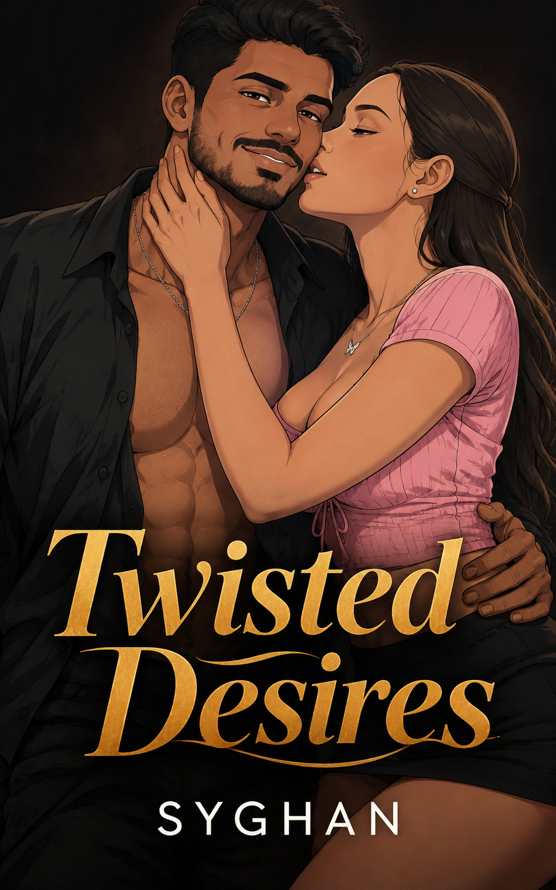

# Syghan — Writer Website



A personal website built with **Next.js**, **TypeScript**, and **Tailwind CSS** for **Syghan**, an upcoming writer from Mumbai, India, and to showcase his upcoming collection of stories, _Twisted Desires_.

The website presents Syghan's writing, author profile, selected stories, and contact information through a dark, literary-focused design.

---

## Live Website

Production URL:

**https://www.syghan.com**

---

## About the Project

_Twisted Desires_ is an upcoming collection of stories inspired primarily by real-life incidents, experiences, and observations, with some fictional elements shaped through imagination.

The stories explore themes such as desire, passion, temptation, vulnerability, guilt, intimacy, and complicated choices.

The website was designed to:

- Present the author and his work
- Introduce _Twisted Desires_
- Publish selected stories
- Provide contact information
- Showcase the author's literary identity

---

## Features

### Public Website

- Home page
- About the author
- Book / collection section
- Selected stories
- Contact form
- Social links
- Custom 404 page

### SEO

- Next.js Metadata API
- Open Graph metadata
- Twitter Cards
- Semantic HTML
- Custom favicon

### Accessibility

- Keyboard navigation
- Skip link
- Focus-visible states
- ARIA attributes where appropriate
- Semantic landmarks
- Accessible forms

### Performance

- Next.js Image Optimization
- Server Components
- Static generation
- Route-based code splitting
- Optimized font loading

---

## Tech Stack

### Next.js

Framework used to build the website.

Why:

- App Router
- Server Components
- Static generation
- Metadata API
- Optimized image handling

### TypeScript

Used throughout the application.

Why:

- Type safety
- Better maintainability
- Easier refactoring
- Improved developer experience

### Tailwind CSS

Used for styling the application.

Why:

- Rapid development
- Consistent styling
- Responsive design
- Utility-first workflow

### React Hook Form

Used for contact form state management.

Why:

- Efficient form handling
- Minimal re-renders
- Simple validation integration

### Zod

Used for form validation.

Why:

- Type-safe schemas
- Reusable validation rules
- Integration with React Hook Form

### Jest

Used for testing.

Why:

- Unit testing
- Component testing
- Reliable test environment

### React Testing Library

Used for testing components from the user's perspective.

Why:

- User-focused testing
- Accessible queries
- Less implementation-dependent testing

### Radix UI

Used where accessible UI primitives are required.

Why:

- Accessibility-focused components
- Headless primitives
- Flexible styling

---

## Project Structure

```text
src/
├── app/
├── components/
│   ├── cards/
│   ├── layout/
│   ├── sections/
│   └── ui/
├── data/
├── lib/
├── types/
└── __tests__/
